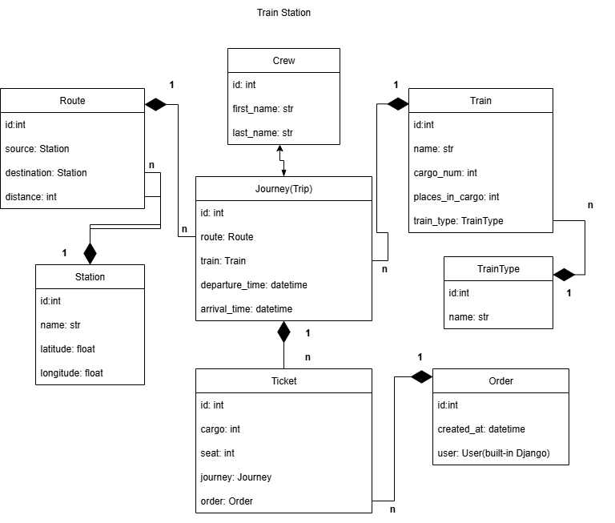

# 🚉 Train Station API

<hr>
API service for Train stations management written on DRF



# 📥Installing using GitHub

## ⚙️ Requirements

Before you begin, make sure you have the following installed:

- [Docker](https://www.docker.com/)
- [Docker Compose](https://docs.docker.com/compose/)
- [Git](https://git-scm.com/)

---


### 1. Clone repository

```bash
  git clone https://github.com/your-username/Train-Station-API.git
  cd trainstation
```
### 2. Install requirements
```
pip install -r requirements.txt
```
### 3. Create database PostgreSQL
```bash
  createdb train_station_db
```
### 4. Create a .env file in the project root with the following variables
```
SECRET_KEY=your-secret-key
POSTGRES_DB=train_db
POSTGRES_USER=train_user
POSTGRES_PASSWORD=train_pass
DB_HOST=db
DB_PORT=5432
```
### 5. Run migrations
```bash
    python manage.py makemigrations
```

# 🐳 Run with Docker

### 1. Run Docker-compose
```bash
  docker-compose up --build
```

# 📚 API Documentation
Swagger is available at:http://localhost:8000/api/doc/swagger/

# 🛠 Technologies
- Django | Django REST Framework
- PostgreSQL
- Docker | Docker Compose
- Django TestCase
- Swagger

